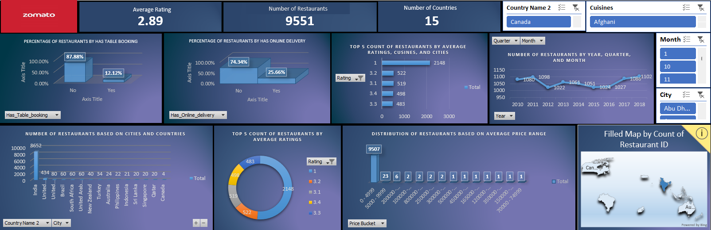

**📊 Project Title**     
**Zomato Restaurant Analytics Dashboard **     

**📌 Short Description**
This Excel dashboard analyzes restaurant data across multiple countries and cuisines. It provides key insights into restaurant counts, ratings distribution, availability of table booking and online delivery, as well as trends over time. Interactive slicers and charts allow for dynamic exploration, enabling stakeholders to make informed decisions in the food industry.     

**⚙️ Tech Stats**     
**📈 Tool Used**: Microsoft Excel (Pivot Tables, Charts, Slicers, Conditional Formatting)     
**📊 Dataset**: Zomato Restaurant Sample Data     
**🌍 Region**: Global (15 countries)     
**📅 Time Period**: 2010–2018     

**💡 Metrics Analyzed**          
                      1.Number of Restaurants         
                      2.Average Ratings     
                      3.Booking and Delivery Options     
                      4.Price Range      
                      5.Location Distribution     

**✨ Features and Highlights**     
**Interactive slicers for** :      
                            1.Country     
                            2.Cuisine     
                            3.City     
                            4.Time period     
**Dynamic charts for:**     
                   1. Percentage of restaurants with table booking and online delivery     
                   2.Top 5 restaurant counts by ratings, cuisines, and cities     
                   3. Yearly, quarterly, and monthly trend analysis     
                   4. Distribution by average price range     
                   5. Geo map showing restaurant count by region     
                   6.Clean, user-friendly visual layout for quick data storytelling     

**📊 Metrics Analyzed**     
Total Restaurants     
Number of Countries and Cities     
Average Ratings     
Booking and Delivery Options     
Ratings distribution     
Price Buckets     
Geo-spatial Distribution     

**✅ Conclusion**     
This Excel dashboard demonstrates the power of spreadsheet-based visual analytics for restaurant industry data. With interactive filtering and clear visuals, it empowers stakeholders to identify high-performing markets, understand customer preferences, and plan business strategies effectively — all within Excel’s familiar interface.     

  

                   

                      

